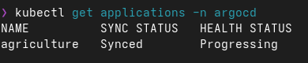
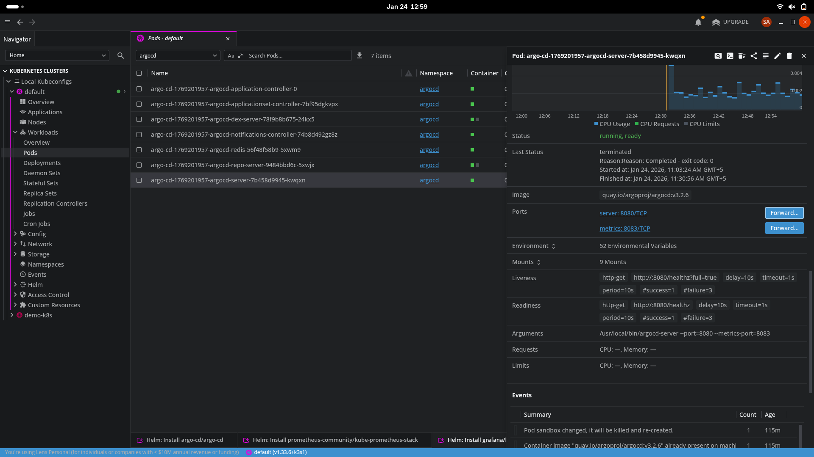
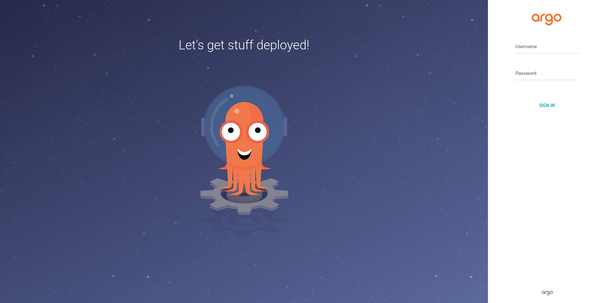
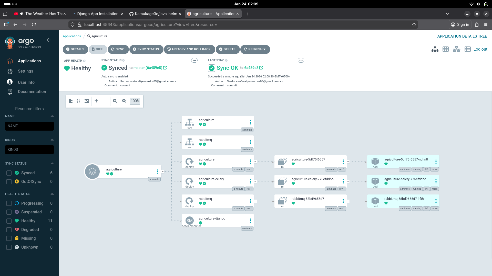
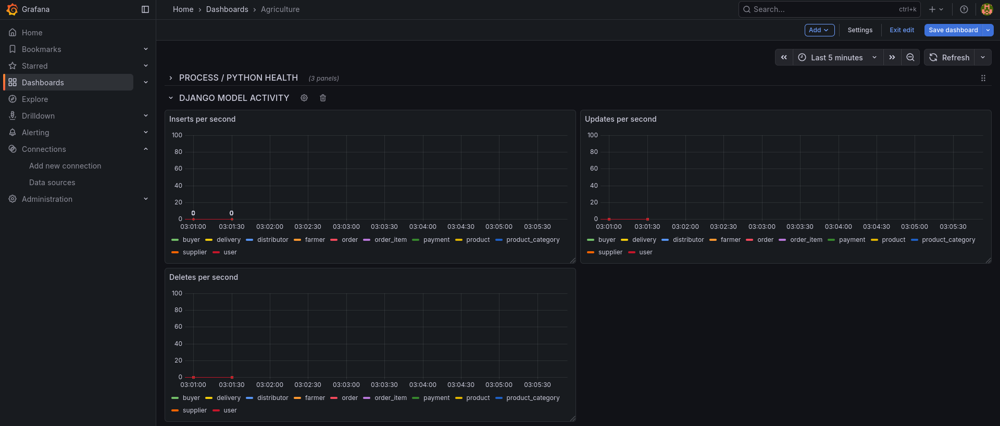
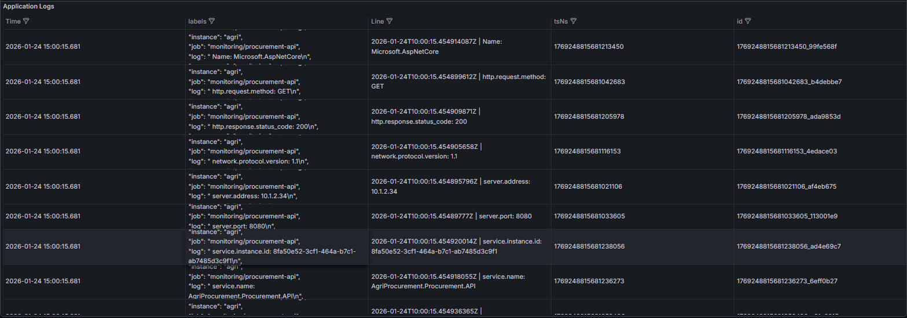

# 🌾 Digital Procurement Platform for Agriculture & Food Production
# Project Overview
This project is a cloud-ready Digital Procurement Platform designed for local agricultural and food-production businesses.
The platform connects farmers, suppliers, buyers, distributors, and food-processing companies into a unified digital ecosystem, helping modernize procurement workflows, improve system reliability, and accelerate digital transformation.
The system was developed as part of a junior DevOps engineering task, focusing on backend services, containerization, observability, and deployment readiness.

# 🏗️ System Architecture
 - Backend: Django + Django REST Framework
 - Architecture Style: Monolith
 - Authentication: JWT (SimpleJWT)
 - Async Processing: Celery + RabbitMQ
 - Monitoring & Observability: Prometheus (django-prometheus)
 - API Documentation: drf-spectacular
 - Deployment: Docker, Docker Compose, Helm charts 
 - Orchestration Ready: Kubernetes (Argo CD compatible)

# 🔧 Prerequisites
 - Python 3.10+ 
 - Django 5.1


# 📁 Project Structure

``` bash
agriculture/
├── agriculture/        # Helm chart for Kubernetes deployment
│   ├── charts/
│   ├── templates/
│   ├── Chart.yaml
│   └── values.yaml
│
├── apps/               # Main Django application
│   ├── migrations/
│   ├── views/
│   ├── models.py
│   ├── serializers.py
│   ├── permissions.py
│   ├── tasks.py
│   ├── urls.py
│   └── admin.py
│
├── root/               # Project-level configuration
├── manage.py
├── db.sqlite3          # Local development database
├── Dockerfile
├── docker-compose.yml
├── requirements.txt
└── README.md
```

# ⚙️ Installation

1️⃣ Clone the repository

``` bash
git clone https://github.com/Safaraliyev05/agriculture.git
cd agriculture
```

2️⃣ Create and activate virtual environment

``` bash
python3 -m venv .venv
source .venv/bin/activate
```

3️⃣ Install dependencies

``` bash
pip install -r requirements.txt
```

4️⃣ Apply database migrations

``` bash
python manage.py migrate
```

6️⃣ Run the development server

``` bash
python manage.py runserver
```

# 🐳 Run with Docker

Build and start containers

``` bash
docker-compose up --build
```

# Test Helm chart
```bash
helm template agriculture agriculture/
```

# Install Helm release
```bash
kubectl create namespace agriculture
helm install agriculture agriculture/ -n agriculture
helm upgrade agriculture agriculture/ -n agriculture
```

# Verify deployment
```bash
kubectl get pods -n agriculture
kubectl get svc -n agriculture
kubectl logs deploy/agriculture -n agriculture
```

# Argocd
Register new app
```bash
kubectl apply -f application.yaml
```
Checking its condition
```bash
kubectl get applications -n argocd
```


# Checking via Web UI
Enter argocd Web UI using Lens
1) Enter lens and open argocd server

2) Enter username(default admin) and password 

   You can get it from config -> secrets in lens

3) Enjoy


# Grafana Dashboard




# Loki logs
